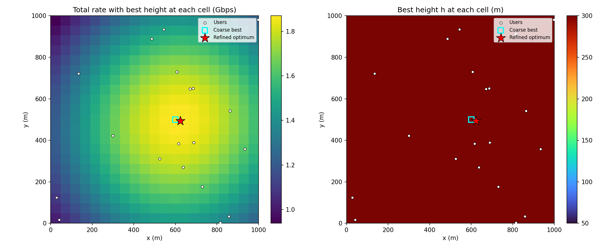
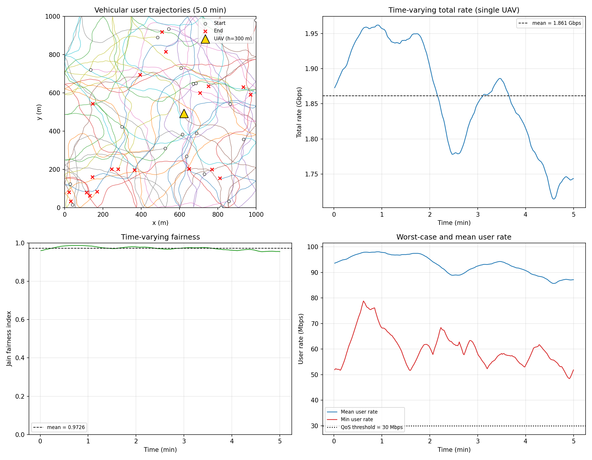
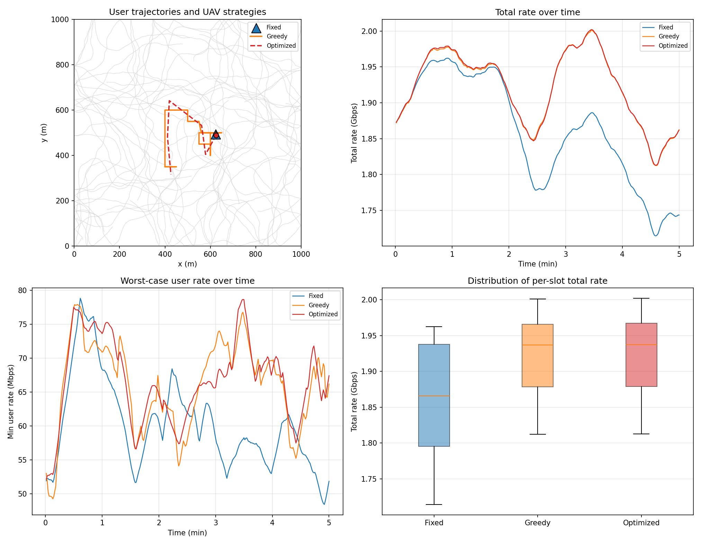
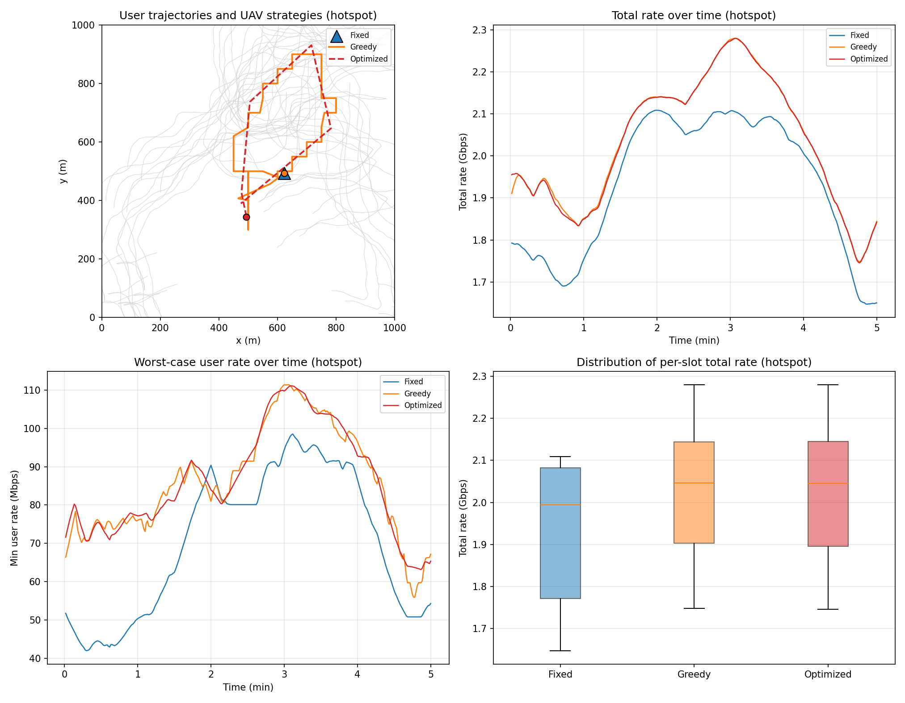
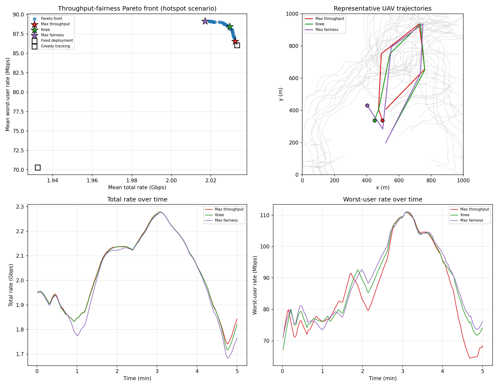

# UAV-BS 部署优化：空地双移动热点场景下的轨迹设计与吞吐量–公平性权衡

本项目研究**单无人机空中基站（UAV-BS）**在**地面用户高速聚集移动**场景下的三维部署与轨迹设计问题。
用户被建模为若干以车辆级速度迁移的热点群组，无人机以航路点形式规划轨迹，
在**系统吞吐量**与**最差用户服务质量**之间取得可量化的折中。

项目由一系列递进的仿真实验组成：从静态部署热力图，到双移动场景建模，
再到多目标轨迹优化与 Pareto 前沿分析，最后给出可用于论文的结论与设计准则。

---

## 1. 研究问题

- 地面用户不再静止：用户分为 3 个热点群组，群组中心以 8–15 m/s（约 29–54 km/h）的车辆级速度迁移，用户群组内部做小幅随机游走；
- 无人机需要动态决策：以 6 个航路点参数化 5 分钟内的轨迹，受最大飞行速度 20 m/s 约束；
- 优化目标是冲突的：既要最大化时间平均总速率（吞吐），又要最大化时间平均最差用户速率（服务质量底线）；
- 核心问题：**是否值得为最差用户牺牲吞吐？贪心式短视决策能否同时做好这两件事？**

## 2. 主要发现

1. **轨迹优化显著优于最优固定部署。**
   在热点移动场景中，相对“针对整段轨迹优化的固定位置”基线，轨迹优化使平均总速率提升约 5%，
   最差用户速率提升约 60%（42.01 Mbps → 63–71 Mbps）。

2. **贪心策略存在“吞吐错觉”。**
   逐时隙贪心的平均吞吐（2.0333 Gbps）与 Pareto 前沿的最大吞吐解（2.0315 Gbps）几乎相同，
   但其最差时隙最低用户速率仅为 55.94 Mbps，明显低于前沿解的 64.47–71.29 Mbps。
   只看当前时刻最优的短视决策无法保障服务质量底线。

3. **公平性几乎不牺牲吞吐。**
   从最大吞吐解切换到最大公平解，平均总速率仅下降约 0.8%，
   而最差时隙最低用户速率提升约 10.6%。折中解（knee point）在两项指标上都接近最优。

**设计准则**：在双移动热点场景中，应把最差用户速率纳入优化目标，而不是在吞吐最优解上事后评估公平性。

## 3. 系统模型

### 3.1 场景与移动模型

| 参数 | 取值 |
|---|---|
| 区域 | 1000 m × 1000 m 方形区域 |
| 用户数量 | 20 |
| 热点群组 | 3 个，群组半径 120 m |
| 群组中心速度 | 8–15 m/s（车辆级），Gauss-Markov 模型（α = 0.9，σ = 3.0 m/s） |
| 用户局部速度 | 0.2–2.0 m/s，群组内部随机游走 |
| 仿真时长 | 300 个时隙 × 1 s = 5 分钟 |
| 无人机高度 | 300 m |
| 无人机最大速度 | 20 m/s（约 72 km/h） |
| 航路点 | 6 个，间隔 60 s，线性插值成逐时隙轨迹 |

### 3.2 空地概率视距信道（A2G）

对第 $k$ 个用户与无人机的链路，水平距离与三维距离分别为

$$d_{2d,k}=\sqrt{(x_k-x_u)^2+(y_k-y_u)^2},\qquad d_{3d,k}=\sqrt{d_{2d,k}^2+h^2}$$

仰角与视距概率（Al-Hourani 模型）为

$$\theta_k=\arctan\!\left(\frac{h}{d_{2d,k}}\right),\qquad P_{\mathrm{LoS},k}=\frac{1}{1+a\exp\!\big(-b(\theta_k-a)\big)}$$

平均路径损耗为

$$PL_k=P_{\mathrm{LoS},k}\cdot PL_{\mathrm{LoS},k}+\big(1-P_{\mathrm{LoS},k}\big)\cdot PL_{\mathrm{NLoS},k}$$

$$PL_{\mathrm{LoS},k}=20\log_{10}\!\left(\frac{4\pi f_c d_{3d,k}}{c}\right)+\eta_{\mathrm{LoS}},\qquad PL_{\mathrm{NLoS},k}=20\log_{10}\!\left(\frac{4\pi f_c d_{3d,k}}{c}\right)+\eta_{\mathrm{NLoS}}$$

用户速率为

$$\gamma_{k,\mathrm{dB}}=P_t^{\mathrm{dBm}}-PL_k-\big(N_0+10\log_{10}B\big),\qquad R_k=B\log_2\!\big(1+\gamma_k\big)$$

### 3.3 信道参数

| 参数 | 取值 | 含义 |
|---|---|---|
| $f_c$ | 2 GHz | 载波频率 |
| $B$ | 10 MHz | 带宽 |
| $P_t$ | 20 dBm | 发射功率 |
| $N_0$ | −174 dBm/Hz | 噪声功率谱密度 |
| $a,\ b$ | 9.61, 0.16 | 城区环境 LoS 概率参数 |
| $\eta_{\mathrm{LoS}}$ | 1 dB | 视距额外损耗 |
| $\eta_{\mathrm{NLoS}}$ | 20 dB | 非视距额外损耗 |

### 3.4 评价指标

- 用户速率 $R_k$（bps）
- 总速率 $R_{\mathrm{sum}}=\sum_k R_k$
- Jain 公平性指数

$$J=\frac{\left(\sum_k R_k\right)^2}{K\sum_k R_k^2}$$

- 最差用户速率 $\min_k R_k$
- 服务质量门限：低于 30 Mbps 视为不满足业务需求

### 3.5 多目标优化问题

决策变量为航路点坐标 $(x_m,y_m),\ m=1,\dots,6$，目标为

$$\max\ f_1=\frac{1}{T}\sum_{t=1}^{T}\sum_{k=1}^{K}R_k(t),\qquad
\max\ f_2=\frac{1}{T}\sum_{t=1}^{T}\min_k R_k(t)$$

约束为区域边界与最大飞行速度：

$$0\le x_m,y_m\le 1000,\qquad \|(x_{m+1},y_{m+1})-(x_m,y_m)\|\le v_{\max}\Delta t_{\mathrm{wp}}$$

## 4. 仓库结构

```
UAV-BS 部署优化/
├── simple_uav_simulation.py            # 基础模型：A2G 信道、单用户/总速率计算
├── uav_position_optimization.py        # 静态场景：网格扫描 + 差分进化搜索最优位置
├── multi_uav_objectives.py             # 多无人机评估：用户接入、总速率、公平性
├── dual_mobility_simulation.py         # 双移动仿真：时间时隙 + 车辆级用户移动
├── trajectory_comparison.py            # 轨迹对比：固定 / 贪心 / 航路点优化
├── hotspot_trajectory_comparison.py    # 热点聚集移动场景下的轨迹对比
├── pareto_trajectory_optimization.py   # NSGA-II 多目标优化与 Pareto 前沿
├── model_validation.py                 # 信道与速率模型的一致性验证
├── requirements.txt                    # 依赖清单
├── uav_rate_heatmap.png                # 静态部署热力图
├── multi_uav_scenario.png              # 多无人机接入示意图
├── dual_mobility_metrics.png           # 双移动场景指标时间序列
├── trajectory_comparison.png           # 均匀用户场景轨迹对比
├── hotspot_trajectory_comparison.png   # 热点场景轨迹对比
├── pareto_front.png                    # 吞吐量–公平性 Pareto 前沿
└── *.csv                               # 逐时隙指标与 Pareto 解集数据
```

## 5. 快速开始

环境要求：Python 3.9+（本项目在 Python 3.13 上验证），依赖见 `requirements.txt`。

```bash
pip install -r requirements.txt
```

推荐按以下顺序运行，每一步都对应研究推进的一环：

```bash
python simple_uav_simulation.py            # 基础信道与速率计算
python uav_position_optimization.py        # 静态最优位置与热力图
python multi_uav_objectives.py             # 多无人机接入与公平性指标
python dual_mobility_simulation.py         # 双移动场景时间序列
python trajectory_comparison.py            # 均匀用户：三种策略对比
python hotspot_trajectory_comparison.py    # 热点用户：三种策略对比
python pareto_trajectory_optimization.py   # 多目标优化与 Pareto 前沿
```

其中 `pareto_trajectory_optimization.py` 约需 15 秒，
`hotspot_trajectory_comparison.py` 约需 30–40 秒（含贪心网格搜索与差分进化）。

## 6. 实验结果

### 6.1 静态部署

均匀用户场景下，最优部署位置为 (623.06, 492.96, 300.00) m，
总速率约 1.87 Gbps。热力图显示高度取上限 300 m 时性能最好。



### 6.2 双移动场景（车辆级用户）

单无人机固定在静态最优位置，用户以 8–15 m/s 移动：
动态平均总速率 1.861 Gbps，波动范围 1.714–1.962 Gbps，
Jain 公平性 0.9726，最差时隙最低用户速率 48.5 Mbps。



### 6.3 三种策略对比（均匀用户）

| 策略 | 平均总速率 | 总速率标准差 | Jain | 平均最低速率 | 最差时隙最低速率 |
|---|---|---|---|---|---|
| 固定部署 | 1.8613 Gbps | 0.0746 | 0.9726 | 60.21 Mbps | 48.45 Mbps |
| 逐时隙贪心 | 1.9220 Gbps | 0.0506 | 0.9792 | 66.18 Mbps | 49.28 Mbps |
| 航路点优化 | 1.9226 Gbps | 0.0509 | 0.9797 | 66.70 Mbps | 52.17 Mbps |



结论：均匀分布下，贪心已能获得绝大部分收益，复杂优化的边际价值有限。

### 6.4 三种策略对比（热点聚集用户）

| 策略 | 平均总速率 | 总速率标准差 | Jain | 平均最低速率 | 最差时隙最低速率 |
|---|---|---|---|---|---|
| 最优固定部署 | 1.9324 Gbps | 0.1601 | 0.9627 | 70.31 Mbps | 42.01 Mbps |
| 逐时隙贪心 | 2.0333 Gbps | 0.1511 | 0.9904 | 86.05 Mbps | 55.94 Mbps |
| 航路点优化 | 2.0322 Gbps | 0.1518 | 0.9908 | 86.28 Mbps | 63.16 Mbps |



结论：热点迁移使轨迹优化的价值显著上升；贪心的吞吐接近最优，但最差用户速率明显落后。

### 6.5 多目标优化（NSGA-II）

共得到 39 个非支配解，三个代表解如下：

| 方案 | 平均总速率 | 平均最低速率 | 最差时隙最低速率 | Jain |
|---|---|---|---|---|
| 最大吞吐解 | 2.0315 Gbps | 86.56 Mbps | 64.47 Mbps | 0.9911 |
| 折中解（knee） | 2.0287 Gbps | 88.51 Mbps | 67.17 Mbps | 0.9935 |
| 最大公平解 | 2.0158 Gbps | 89.19 Mbps | 71.29 Mbps | 0.9949 |
| 最优固定部署 | 1.9324 Gbps | 70.31 Mbps | 42.01 Mbps | 0.9627 |
| 逐时隙贪心 | 2.0333 Gbps | 86.05 Mbps | 55.94 Mbps | 0.9904 |



## 7. 论文层面的贡献与定位

本项目当前的贡献可以表述为三条：

1. **场景建模**：将车辆级热点群组移动与概率视距 A2G 信道统一到分时隙无人机轨迹优化框架中；
2. **问题建模**：以“时间平均总速率”和“时间平均最差用户速率”为双目标，给出 Pareto 前沿与折中解，而非仅最大化总速率；
3. **实证发现与设计准则**：量化了贪心策略的“吞吐错觉”，并证明公平性提升几乎不牺牲吞吐，据此给出轨迹设计准则。

当前的算法（NSGA-II）是标准求解器，不作为算法层面的创新点；
这一部分将在期刊版本中通过自研算法组件补强。

## 8. 当前局限与后续计划

当前局限：

- 仅考虑单无人机，未涉及无人机间干扰与频谱分配；
- 无人机高度固定为 300 m，未优化三维轨迹；
- 未建立推进/悬停能耗模型；
- 实验基于单组随机场景，缺少蒙特卡洛统计与参数敏感性分析；
- 求解器为现成的 NSGA-II，缺少算法层面的创新。

后续计划：

1. 扩展为 2–4 架无人机，联合优化轨迹与用户接入（多无人机评估层已具备）；
2. 提出预测型滚动时域优化或交替优化算法，并给出复杂度分析；
3. 引入能量模型与三维轨迹（含高度优化），构建能效目标或三目标优化；
4. 开展 20–50 组随机场景的蒙特卡洛实验，给出均值、误差棒与参数敏感性；
5. 复现并对比 2–3 种已有文献方法，完成英文写作与投稿。

投稿路线：先投 EI 会议（如 IEEE/CIC ICCC、IEEE WCSP、IEEE ICCT、IEEE VTC），
再扩展为 SCI 三区期刊版本（如 Physical Communication、China Communications、
IEEE Access、Drones、EURASIP JWCN 等，投稿前需按当年分区核实）。

## 8. 数据来源与参数溯源

本项目不涉及实测数据采集，全部结果为**基于标准信道模型与移动模型的系统级仿真数据**，
使用固定随机种子生成，可通过脚本完全复现。

| 数据/参数 | 取值 | 来源类型 | 说明 |
|---|---|---|---|
| 用户初始位置 | 区域内均匀随机 / 群组圆盘内均匀采样 | 合成数据 | 由本项目脚本生成，随机种子 0 |
| 用户移动 | Gauss-Markov 模型 | 经典移动模型 | Liang & Haas / Camp 等移动模型文献 |
| 热点群组移动 | 参考点群组移动（RPGM 风格） | 经典移动模型 | Hong 等提出的群组移动模型 |
| $a,\ b$ | 9.61, 0.16（城区） | 文献标定值 | Al-Hourani 等, *Optimal LAP Altitude for Maximum Coverage*, IEEE WCL, 2014 |
| $f_c$ | 2 GHz | 常用系统参数 | 典型蜂窝/UAV 通信仿真取值 |
| $B$ | 10 MHz | 常用系统参数 | 典型 LTE 风格带宽 |
| $P_t$ | 20 dBm | 常用系统参数 | 典型下行发射功率 |
| $N_0$ | −174 dBm/Hz | 物理常数 | 290 K 下的热噪声功率谱密度 |
| $\eta_{\mathrm{LoS}}$ | 1 dB | 文献常用值 | A2G 文献常用取值，论文中需绑定具体引用 |
| $\eta_{\mathrm{NLoS}}$ | 20 dB | 文献常用值 | A2G 文献常用取值，论文中需绑定具体引用 |
| 服务质量门限 | 30 Mbps | 建模假设 | 业务门限假设，需做敏感性分析 |
| 随机种子 | 0 / 1 / 2 / 1 | 复现设置 | 分别对应用户分布、用户移动、热点移动、NSGA-II |

补充说明：

- 自由空间路径损耗项是电磁波传播的解析公式，不属于经验拟合参数；
- Al-Hourani 模型的环境参数表为：郊区 (4.88, 0.43)、城区 (9.61, 0.16)、
  密集城区 (12.08, 0.11)、高层城区 (27.23, 0.08)；
- 山区、农村环境没有标准参数，计划以郊区参数作为代理，并补充地形附加损耗的敏感性分析；
- 论文中需要对每个参数逐条标注引用，不能只写“常用取值”。

## 9. 模型验证

运行 `python model_validation.py` 可执行实现级验证，当前结果为 **5/5 全部通过**。
验证目的是确认公式实现、几何关系与单位换算没有错误，而不是与实测数据比对。

| 验证项 | 方法 | 结果 |
|---|---|---|
| 路径损耗几何与加权实现 | 与独立解析计算对比（$d_{2d}$ = 400 m, $h$ = 300 m） | PASS，95.5169 dB 完全一致 |
| 信噪比单位换算 | dBm 口径 vs 线性功率口径 | PASS，均为 24.000000 dB |
| LoS 概率性质 | 仰角 0°–90° 扫描，检查取值范围与单调性 | PASS，$P_{\mathrm{LoS}}(0°)=0.0219$，$P_{\mathrm{LoS}}(90°)=0.99998$ |
| 速率随距离的单调性 | 水平距离 100–1000 m | PASS，114.7 → 34.0 Mbps 单调下降 |
| 总速率一致性 | 逐用户求和 vs `compute_total_rate` | PASS，1838990465.06 bps 一致 |

链路预算参考算例（可用于论文中的人工复核）：
$d_{2d}$ = 500 m、$h$ = 300 m 时，$P_{\mathrm{LoS}}$ = 0.7602，平均路径损耗 = 99.33 dB，
噪声功率 = −104.0 dBm，信噪比 = 24.67 dB，单用户速率 = 81.99 Mbps。

计划补充的验证：

- 复现 Al-Hourani 模型中“最优飞行高度随覆盖半径变化”的定性趋势
  （需要匹配原文的覆盖率门限设置）；
- 增加“按 LoS/NLoS 概率对速率加权”的严格口径，与当前的“平均路径损耗”口径对比，
  量化 Jensen 不等式带来的高估幅度。

## 10. 复现性说明

所有实验使用固定随机种子，结果可复现：

- 用户初始分布：随机种子 0（`multi_uav_objectives.SEED`）
- 用户移动过程：随机种子 1（`dual_mobility_simulation.MOBILITY_SEED`）
- 热点群组移动：随机种子 2（`hotspot_trajectory_comparison.HOTSPOT_SEED`）
- 静态位置搜索：差分进化种子 0
- 多目标优化：NSGA-II 种子 1（种群 40，进化 60 代）

逐时隙指标与 Pareto 解集分别保存在对应的 `*.csv` 文件中，可直接用于论文作图与统计。
